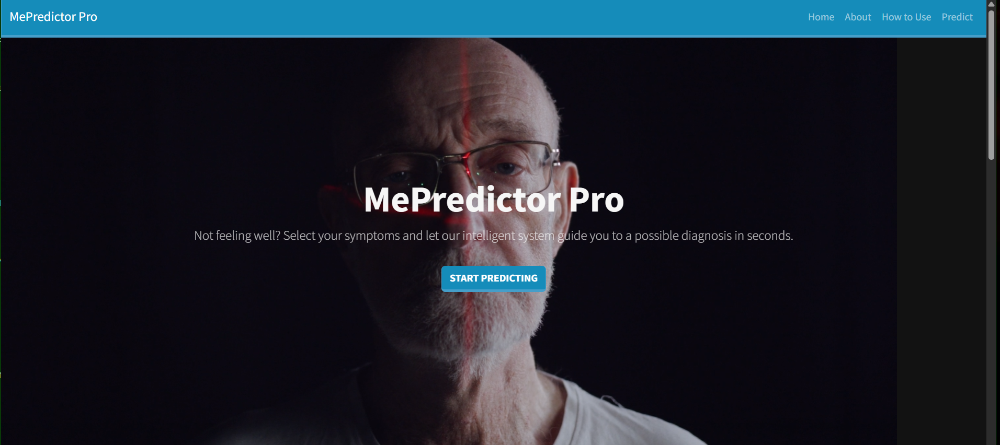
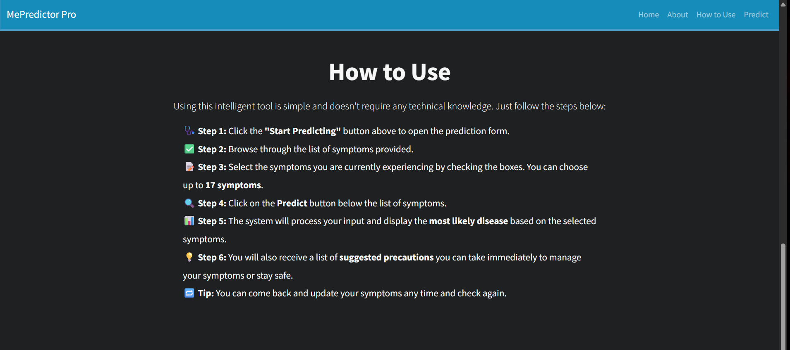
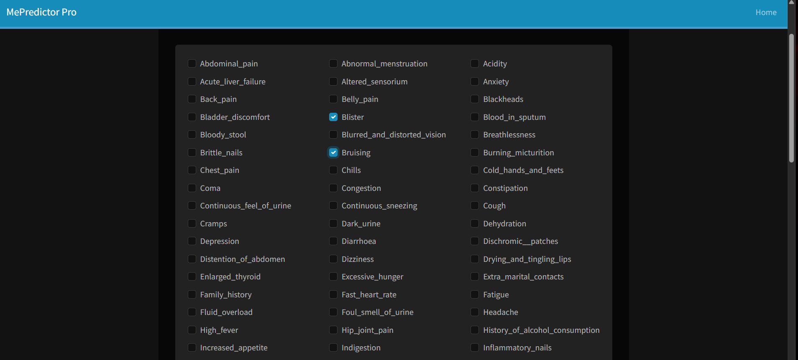
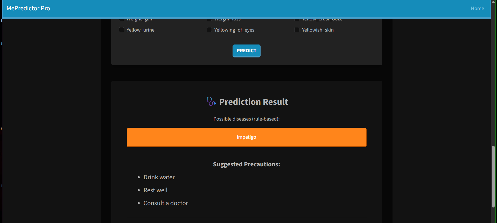

# 🧠 MePredictor Pro

An intelligent disease prediction system using Machine Learning and Django.

---

## 🚀 What It Does

- Users can select up to **17 symptoms** from a list.
- Predicts the **most probable disease** using a trained ML model.
- Displays suggested **precautions** for the predicted disease.

---

## 🛠️ Tech Stack

- **Python 3**
- **Django** (Web framework)
- **Scikit-learn** (ML model)
- **HTML / CSS / Bootstrap**
- **JavaScript**
- **Video Background Integration**
- **Git & GitHub**

---

## 💻 How to Run It

1. **Clone the Repository:**
   ```bash
   git clone https://github.com/bittuz/me_predictor.git
   cd me_predictor

2.Create a Virtual Environment & Activate It:

Windows:

python -m venv venv
venv\Scripts\activate

Linux/Mac:

python3 -m venv venv
source venv/bin/activate

3.Install Requirements:

pip install -r requirements.txt

4.Run the Server:

Go to: http://127.0.0.1:8000

## 🖼️ Screenshots

### Homepage


### How to Use


### Symptoms Selection


### Prediction Result



🤖 Machine Learning Model
Trained on a dataset with 17 symptoms and 41 diseases.

Uses Decision Tree Classifier for prediction.

Saved model: dis_model.pkl.

📁 Folder Structure

me_predictor/
├── disease/
│   ├── templates/
│   ├── static/
│   ├── views.py
│   └── ...
├── media/
│   └── background.mp4
├── screenshots/
│   ├── screenshot1.png
│   ├── screenshot2.png
│   ├── screenshot3.png
│   └── screenshot4.png
├── db.sqlite3
├── manage.py
└── README.md


📬 Contact
Made with ❤️ by Bittu B

GitHub: bittuz

Email: bittu.john08@gmail.com